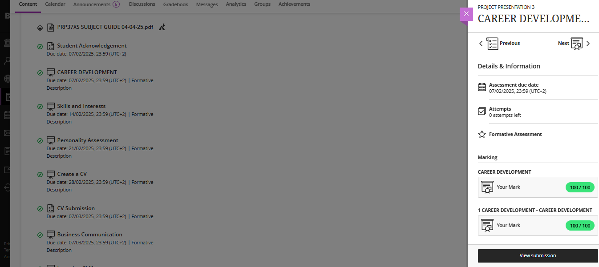

# Digital Portfolio  
**Name:** Caleb Lombard  
**Student Number:** 230781004 
**Stream:** Multimedia Applications
**Course:** PRP370S - Project Presentation 3 

---

## 1. Career Counselling  
### Evidence  
- Proof of my Blackboard Submission: 

### Reflection 

**Situation**: I had to interact and read through a slide show presentation that discussed Skills and Interests. I had to complete all the activities in the slideshow and also finish the exam at the end of the slideshow to complete the submission.

**Task**: I had to watch a slideshow presentation and I also had to complete a small exam at the end that accessed what I learned from the slideshows.

**Action**: I read about career development strategies and reflected on my own career goals. I read through all the information in the slideshow and did the small exam at the end of the slideshow that tested my understanding of what I read. 

**Result**: The presentation deepened my understanding of how to plan and prepare for my career. It also motivated me to set clearer goals and take actionable steps toward my professional future. I am also more informed on things I lacked knowledge on before.

---

## 2. Skills and Interests  
### Evidence  
- Proof of my Blackboard Submission:

### Reflection  

**Situation**: I had to interact and read through a slide show presentation that discussed Skills and Interests. I had to complete all the activities in the slideshow and also finish the exam at the end of the slideshow to complete the submission.

**Task**: I had to watch a slideshow presentation and I also had to complete a small exam at the end that accessed what I learned from the slideshows.

**Action**:  I read through all the information in the slideshow and did the small exam at the end of the slideshow that tested my understanding of what I read.

**Result**: This activity helped me reflect on my strengths and passions, increasing my confidence in articulating them for future opportunities. I am also more informed on things I lacked knowledge on before. 

---

## 3. Personality Assessment  
### Evidence  
- Proof of my Blackboard Completion:  

### Reflection  

**Situation**: I had to interact and read through a slide show presentation that discussed Personality Assessment. I had to complete all the activities in the slideshow and also finish the exam at the end of the slideshow to complete the submission.

**Task**: The goal of the slideshow was present key aspects of our personality, how they relate to the workplace, and how it reflects on our readiness for the professional world. 

**Action**: I read through all the information in the slideshow and did the small exam at the end of the slideshow that tested my understanding of what I read.

**Result**: The slideshow helped me better understand how my personality influences my work behavior and readiness. I am also more informed on things I lacked knowledge on before.

---

## 4. CV Creation  
### Evidence  
- [Proof of My Repo Submission to GitHub](https://github.com/wil-it2025/cv-tutorial-CalebLombard/blob/main/CV%20REVIEW%20-%20Caleb%20Lombard%20230781004.docx).  
- Proof of my Blackboard Submission: 

### Reflection  

**Situation**: I had to submit a completed CV checklist that showed what my previous CV had and what was missing. This was important as it later helped me update my CV to be better suited to professional standards.

**Task**: I had to use a checklist to assess what my current CV included, what was missing, and how it should be structured and formatted according to professional standards.

**Action**: I reviewed my existing CV against the checklist, identified the missing elements, and made all the necessary updates. I ensured the format and content met the required guidelines before finalizing it.  

**Result**: I successfully updated my CV to a more professional standard and submitted it to the WIL repository link as required. This exercise helped me see what was missing and lacked from my previous CV.

---

## 5. CV Submission  
### Evidence  
- Downloadable copy of my CV submitted to [Blackboard Submission](https://github.com/CalebLombard/digital-portfolio/raw/main/CALEB_LOMBARD_CV_230781004.pdf)
- Proof of my Blackboard Submission:   

### Reflection  

**Situation**: I had to create a CV that I would use to help me apply for internships and possibly full time employment in the near future. This was a Blackboard Assignment submission.  

**Task**: I was tasked with using the 'Create a CV' activity as a blueprint for how my CV should look. Based on that activity, I updated my CV by adding all the necessary information that was missing from the previous version using the checklist from the previous activity.

**Action**: I updated my previous CV and made the necessary changes that was required from me. 

**Result**: As a result, I now have a more professional and complete CV that aligns with industry expectations. My updated CV highlights my skills, experience, and qualifications more effectively, making me better prepared to apply for internships and job opportunities.
